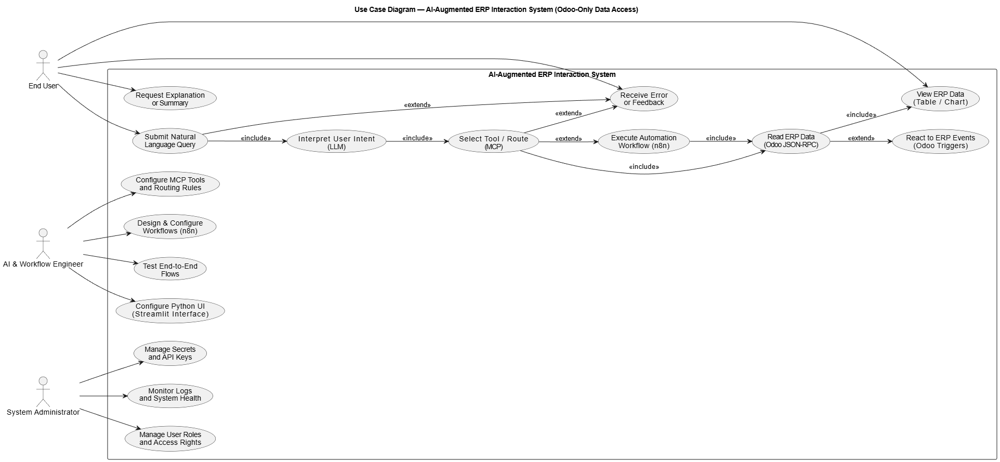
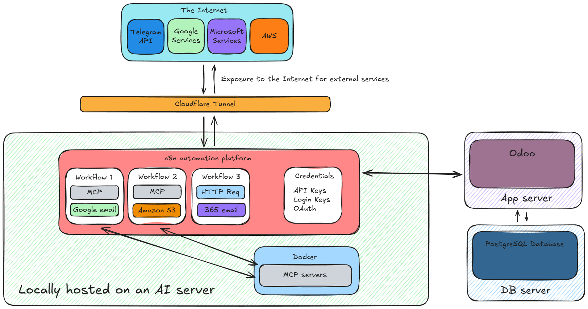
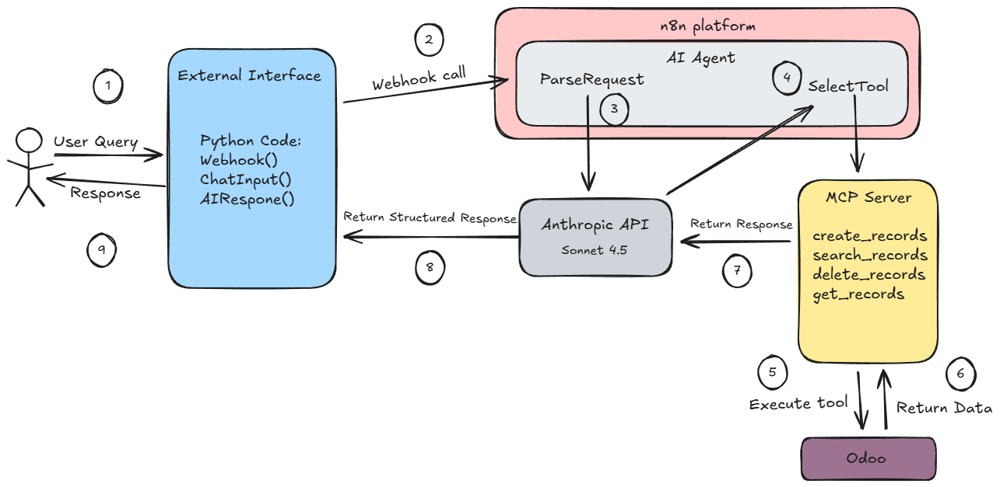
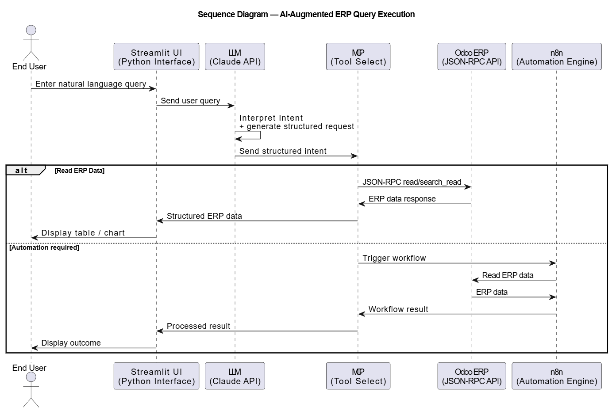

# Intelligent Framework for ERP Systems

This repository contains the project deliverables for the thesis "Intelligent Framework for ERP Systems". The system combines Odoo Community Edition (ERP), a Model Context Protocol (MCP) server for controlled AI access, n8n automation workflows, and a Streamlit front end (ERPGenie).

## Project Summary
- Odoo Community Edition and PostgreSQL provide core ERP data.
- An MCP server exposes safe AI tools for Odoo operations.
- n8n orchestrates AI agents, integrations, and automation workflows.
- ERPGenie offers natural-language chat with charts and tabular output.

## System Diagrams
### Use Case Diagram

### Deployment Diagram

### Sequence Diagram (Chat Flow)

### Sequence Diagram (Automation Flow)

## Repository Structure
- `streamlit-app/` Streamlit UI for ERPGenie (`app.py`).
- `n8n-workflows/` Exported workflow definitions for n8n.
- `odoo-mcp-server/` MCP server implementation and Docker assets.
- `system-diagrams/` Architecture and sequence diagrams.
- `docs/thesis/` Thesis documents (DOCX and TXT).
- `requirements.txt` Python dependencies for the Streamlit UI.

## Components
### ERPGenie Streamlit UI
- Chat interface that sends prompts to an n8n webhook.
- Parses tabular responses and offers charts and CSV export.
- Main entry point: `streamlit-app/app.py`.

### n8n Workflows
- `ai-chatbot-mcp-python.json`: Webhook-driven AI agent that routes requests to the MCP server.
- `chat-with-postgresql-database.json`: AI agent for PostgreSQL Q and A and reporting.
- `health-check-automated.json`: Scheduled health check against the Odoo web health endpoint.
- `business-workflow-email-opportunity.json`: CRM-related automation workflow for email and opportunity handling.

### Odoo MCP Server
- Located in `odoo-mcp-server/`.
- Provides HTTP and stdio MCP transports with Odoo CRUD tooling.
- Setup and usage details are in `odoo-mcp-server/README.md`.

## Prerequisites
- Python 3.10+ for the Streamlit UI.
- n8n (Docker or local installation).
- Odoo Community Edition and PostgreSQL (not included).
- MCP server credentials for Odoo (see `odoo-mcp-server/README.md`).

## Quick Start (ERPGenie Streamlit UI)
1. `pip install -r requirements.txt`
2. Update `WEBHOOK_URL` in `streamlit-app/app.py` to point at your n8n webhook.
3. `streamlit run streamlit-app/app.py`

## Using the n8n Workflows
1. Import `n8n-workflows/*.json` into n8n.
2. Configure credentials for OpenAI or Anthropic, PostgreSQL, IMAP or SMTP, and any other connected services.
3. Update URLs, ports, and hostnames inside workflow nodes for your environment (Odoo health endpoint, MCP server, databases).

## Notes
- Workflow exports include credential references by ID; replace them with your own in n8n.
- Infrastructure details such as Cloudflare Tunnel and VM topology are documented in the thesis.

## License
- This repository does not define a top-level license.
- The `odoo-mcp-server/` subproject includes its own MIT license.
